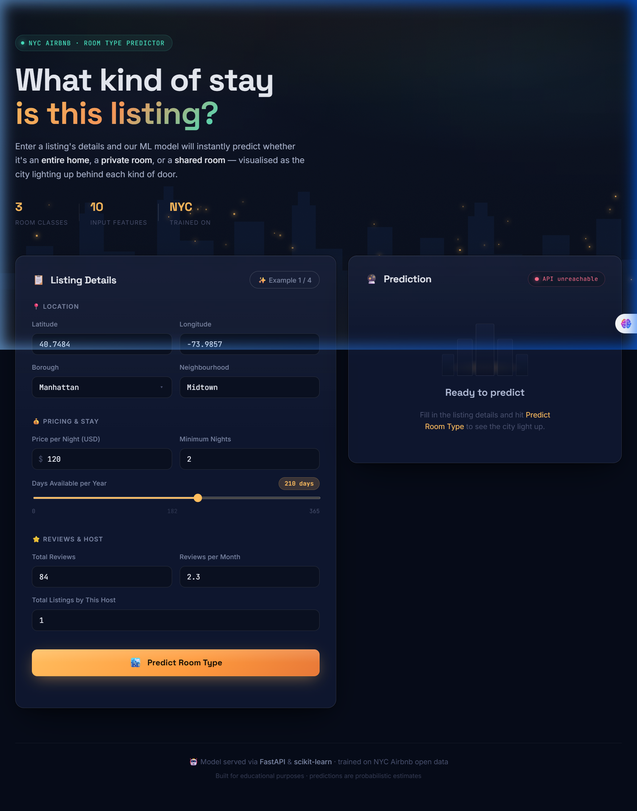
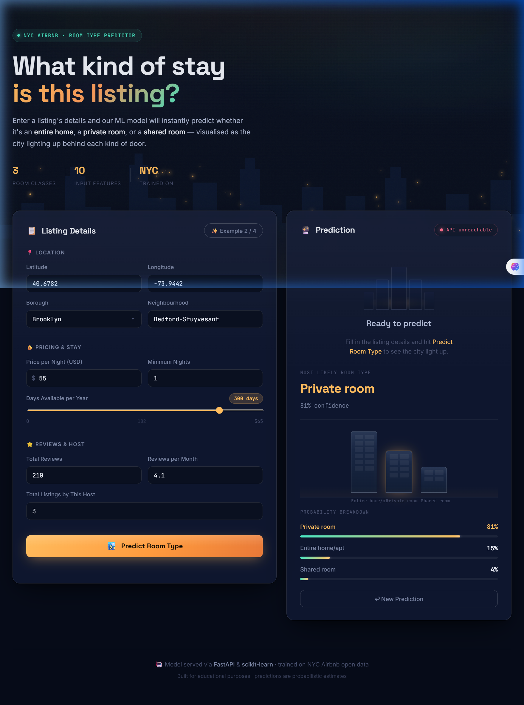

# 🏙️ NYC Airbnb Room Type Predictor

> An AI-powered web application that predicts whether a New York City Airbnb listing is an **Entire home/apt**, **Private room**, or **Shared room** — visualised as the city skyline lighting up.

[](https://nyc-airbnb-room-type-predictor-1-9ols.onrender.com)
[](https://nyc-airbnb-room-type-predictor-tm1a.onrender.com/docs)


---

## 🔗 Live Application Links

- 🌐 **Frontend Web App:** [https://nyc-airbnb-room-type-predictor-1-9ols.onrender.com](https://nyc-airbnb-room-type-predictor-1-9ols.onrender.com)
- ⚡ **Backend API (Swagger Docs):** [https://nyc-airbnb-room-type-predictor-tm1a.onrender.com/docs](https://nyc-airbnb-room-type-predictor-tm1a.onrender.com/docs)

---

## 📸 Screenshots & UI Preview

| 📋 Listing Details Form | 🔮 Prediction & Probability Breakdown |
|:---:|:---:|
|  |  |

---

## ✨ Key Features

- 🔮 **Instant ML Predictions** — Enter listing parameters (borough, neighbourhood, price, minimum nights, reviews) and get real-time room type predictions.
- 📊 **Probability Breakdown** — Animated bar chart displaying percentage confidence for all 3 target classes.
- 🏙️ **NYC Skyline Visualisation** — Interactive skyline building graphic that lights up windows in real time based on model probabilities.
- 🌆 **4 Pre-filled Examples** — Quickly test realistic listings across Manhattan, Brooklyn, Queens, and Bronx.
- 📡 **Live API Health Status** — Real-time indicator showing backend connectivity.
- 📱 **Responsive & Glassmorphism Design** — Dark mode UI crafted with Space Grotesk, Inter, and JetBrains Mono fonts.

---

## 🧠 Machine Learning Model

| Detail | Information |
|---|---|
| **Dataset** | [NYC Airbnb Open Data](https://www.kaggle.com/datasets/dgomonov/new-york-city-airbnb-open-data) |
| **Task** | Multi-Class Classification |
| **Target Classes** | `Entire home/apt`, `Private room`, `Shared room` |
| **Pipeline** | scikit-learn `Pipeline` (Preprocessing + Encoder + Classifier) |
| **Model Artifact** | `Model_Pipeline.pkl` (~37 MB) |
| **Training Notebook** | `nyc_airbnb_room_type_classification.ipynb` |

### Input Features

| Feature | Type | Description |
|---|---|---|
| `latitude` | float | Listing latitude (-90 to 90) |
| `longitude` | float | Listing longitude (-180 to 180) |
| `price` | float | Price per night in USD |
| `minimum_nights` | int | Minimum nights required for booking |
| `number_of_reviews` | int | Total number of guest reviews |
| `reviews_per_month` | float | Average monthly review rate |
| `calculated_host_listings_count` | int | Total listings owned by this host |
| `availability_365` | int | Days available per year (0–365) |
| `neighbourhood_group` | str | NYC Borough (Manhattan, Brooklyn, Queens, Bronx, Staten Island) |
| `neighbourhood` | str | Specific neighbourhood name |

---

## 🗂️ Project Structure

```
NYC-Airbnb-Room-Type-Predictor/
│
├── assets/
│   ├── app_interface.png                         # Screenshot: Form & hero section
│   └── prediction_result.png                     # Screenshot: Prediction result & skyline
│
├── main.py                                       # FastAPI backend service
├── Model_Pipeline.pkl                            # Trained scikit-learn model pipeline (~37 MB)
├── requirements.txt                              # Python dependencies
├── runtime.txt                                   # Python version specifier (python-3.12.9)
├── .python-version                               # Python version environment config
│
├── index.html                                    # Frontend UI structure
├── style.css                                     # Custom CSS design system (glassmorphism)
├── script.js                                     # Frontend interactions & API integration
│
└── nyc_airbnb_room_type_classification.ipynb     # Jupyter notebook (EDA, training, evaluation)
```

---

## 🚀 Quick Start (Local Setup)

### Prerequisites
- Python **3.12+**
- `pip`

### 1. Clone the Repository
```bash
git clone https://github.com/vikashg450/NYC-Airbnb-Room-Type-Predictor.git
cd NYC-Airbnb-Room-Type-Predictor
```

### 2. Install Dependencies
```bash
pip install -r requirements.txt
```

### 3. Run FastAPI Backend
```bash
uvicorn main:app --reload --host 0.0.0.0 --port 8000
```
- API Docs: **http://localhost:8000/docs**

### 4. Serve Frontend
In a new terminal window:
```bash
python -m http.server 7891
```
Open **http://localhost:7891** in your browser.

> 💡 *Note: To connect the local frontend to your local API, set `const API_BASE_URL = "http://localhost:8000";` in `script.js`.*

---

## 🌐 API Endpoints

### `GET /`
Health check endpoint.
```json
{
  "status": "ok",
  "message": "NYC Airbnb Room Type Predictor API is running."
}
```

### `POST /predict`
Submits listing details to obtain room type predictions.

**Sample Request Payload:**
```json
{
  "latitude": 40.7484,
  "longitude": -73.9857,
  "price": 120,
  "minimum_nights": 2,
  "number_of_reviews": 84,
  "reviews_per_month": 2.3,
  "calculated_host_listings_count": 1,
  "availability_365": 210,
  "neighbourhood_group": "Manhattan",
  "neighbourhood": "Midtown"
}
```

**Sample Response:**
```json
{
  "Predicted_room_type": "Entire home/apt",
  "Probability": [0.87, 0.11, 0.02]
}
```

---

## 🛠️ Tech Stack

- **Backend:** [FastAPI](https://fastapi.tiangolo.com/), [Uvicorn](https://www.uvicorn.org/), [scikit-learn](https://scikit-learn.org/), [pandas](https://pandas.pydata.org/), [Pydantic](https://docs.pydantic.dev/)
- **Frontend:** Vanilla HTML5, CSS3 (Glassmorphism & CSS Animations), JavaScript (Async/Fetch API)
- **Deployment:** [Render](https://render.com) (Web Service & Static Site)

---

## 👤 Author

Developed by **[Vikash](https://github.com/vikashg450)**  
Trained on open NYC Airbnb data for educational & demonstration purposes.
